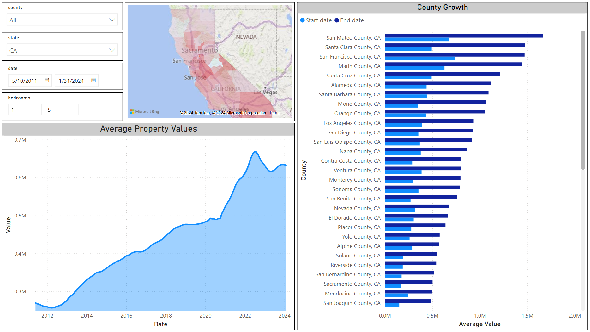

# Zillow Real Estate Data Project

## Overview
This project implements an end-to-end data pipeline that ingests Zillow Home Value Index (ZHVI) data, transforms it into an analysis-ready relational format, loads it into a PostgreSQL database, and visualizes trends using Power BI.
The final deliverable is an interactive Power BI dashboard that allows users to analyze historical property value trends by **state, county, bedroom count, and time range**, including calculated growth metrics over user-selected periods.

## Problem Statement
The raw ZHVI CSV files present several challenges:

- Wide time-series format with hundreds of date columns
- Bedroom data split across multiple files
- Repeated geographic metadata
- Missing values that must be handled consistently
- Not optimized for SQL-based analysis or BI tools

This project resolves those issues by transforming the data into a normalized, relational structure suitable for PostgreSQL and Power BI.

## Setup
1. Clone the repository.
2. Set up a virtual environment and install dependencies.
3. Modify the `db_config.txt` file to include your PostgreSQL credentials.
4. Run `ETL.py`.

## Tech Stack

Data Engineering
- Python
- Pandas – data extraction, transformation, reshaping
- SQLAlchemy – PostgreSQL connection and data loading
- Matplotlib / Seaborn – data quality and null-value visualization

Database
- PostgreSQL

Business Intelligence
- Power BI
- DAX – growth and time-window calculations

## Power Bi
Using DAX scripts along with the data from my database, I created an interactive dashboard that allows users to filter data by state, county, timeframe, and number of bedrooms. The dashboard includes the following visualizations:

1. A heatmap showing which counties in the selected state have seen the most growth.
2. A county growth chart displaying the counties with the highest property values.
3. A line chart showing the average property values over time.

