# Zillow Real Estate Data Project

## Overview
This project processes and loads real estate data from Zillow into a PostgreSQL database.

## Setup
1. Clone the repository.
2. Set up a virtual environment and install dependencies.
3. Modify the `db_config.txt` file to include your PostgreSQL credentials.
4. Run `ETL.py`.

## Purpose
The purpose of this project is to create a Power BI dashboard that allows me to analyze how property values have evolved over the years. All the data used in this project was obtained from Zillow's Home Value Index (ZHVI):

https://www.zillow.com/research/data/

According to Zillow, the data in these .csv files reflect the "typical home value and market changes across a given region and housing type." The data is separated into documents based on the number of bedrooms in each home, and it provides data and metrics for all counties in all states from 2000 to 2024

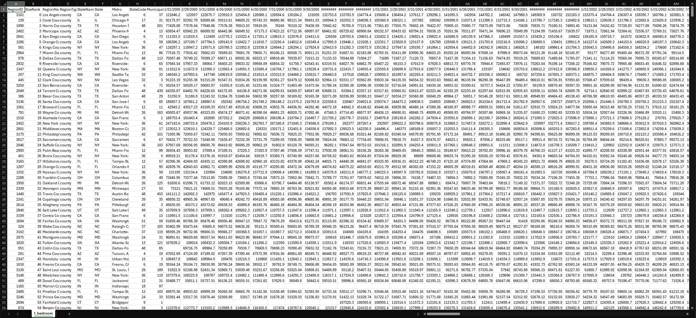

However, the data in its current format is unorganized, contains unnecessary information, and is split across five different .csv files based on the number of bedrooms (one through five+ bedrooms). To address this, I created an ETL (Extract, Transform, Load) script in Python to clean and organize the data.

## Python 
The ETL script uses the following Python libraries:
- **Pandas** for data extraction and manipulation.
- **Seaborn** to visualize null values.
- **SQLAlchemy** to connect to PostgreSQL and commit data.

Below is the main function to give an overview of what the ETL script is doing.

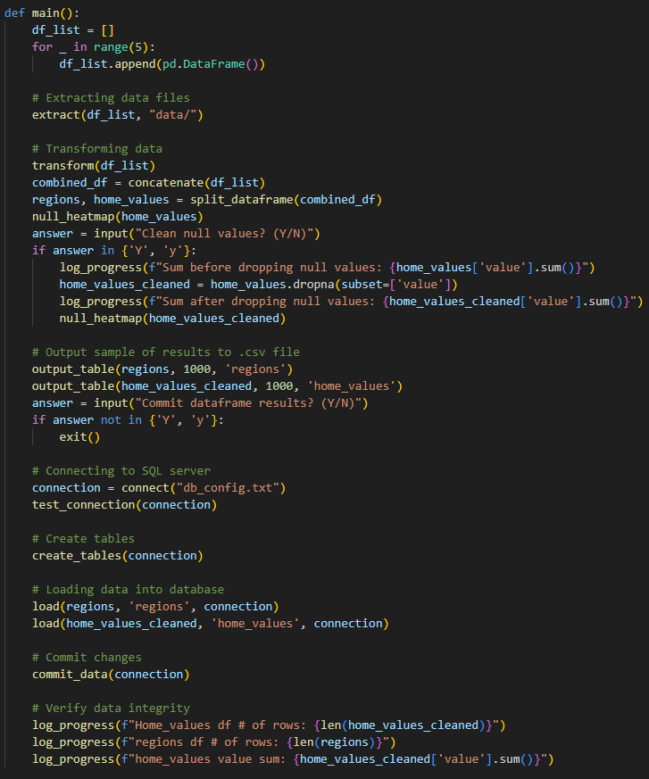

First, I created a log method to track progress and identify errors.

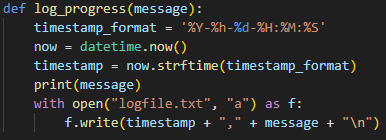

Next, I extracted all of the .csv data into a list of Pandas dataframes.

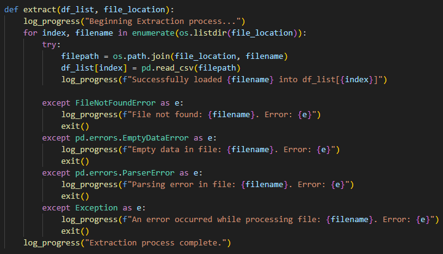

Then, I used Pandas to melt the dataframes into as few columns as possible. This ensures that the combination of date, county, and number of bedrooms can be used as a primary key to retrieve the average property value.

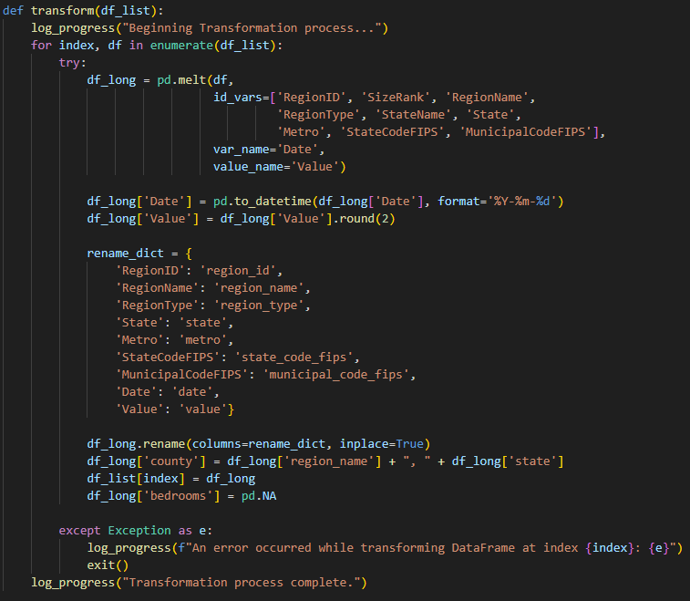

Next, I concatenated all the dataframes into a single dataframe and added a column to indicate the number of bedrooms. Once that was done, I split the final dataframe into the appropriate columns to match the final tables in PostgreSQL.

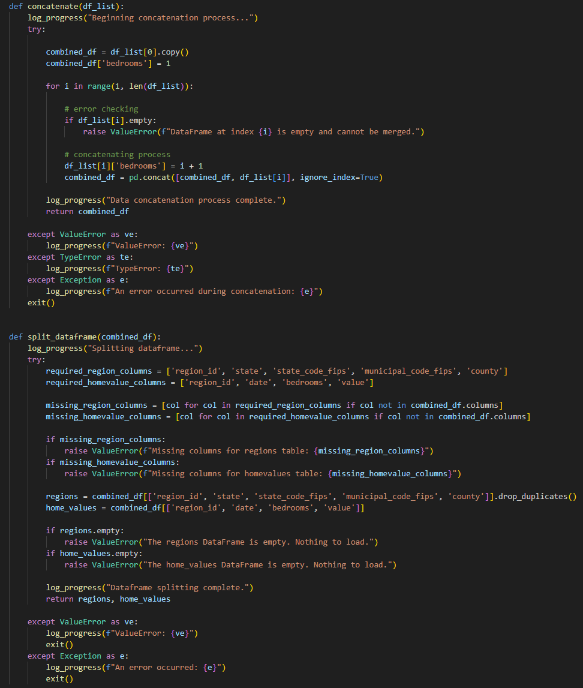

With the data now more organized, I used Seaborn to identify where null values are present, and Matplotlib to visualize them.

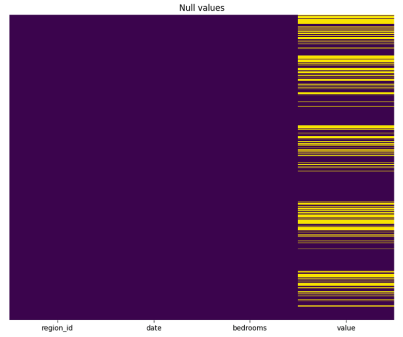

After removing the rows with null values, I checked visually to confirm the data was cleaned.

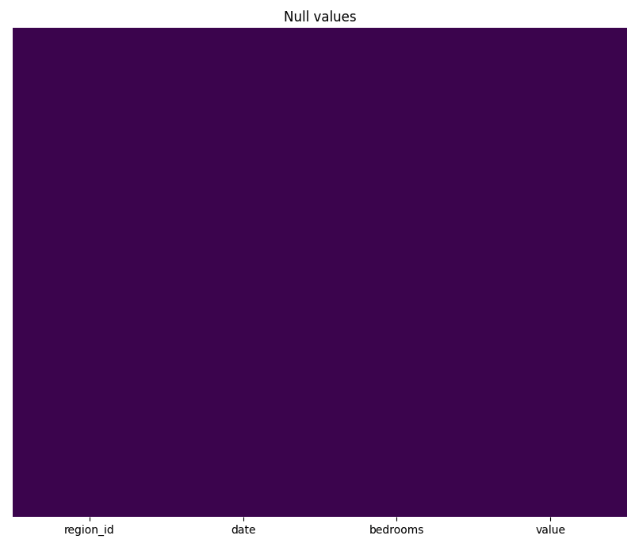

Now that the data was transformed and cleaned, I connected to my PostgreSQL database using SQLAlchemy. With this code, I used my credentials to establish a connection and tested it to confirm it was working.

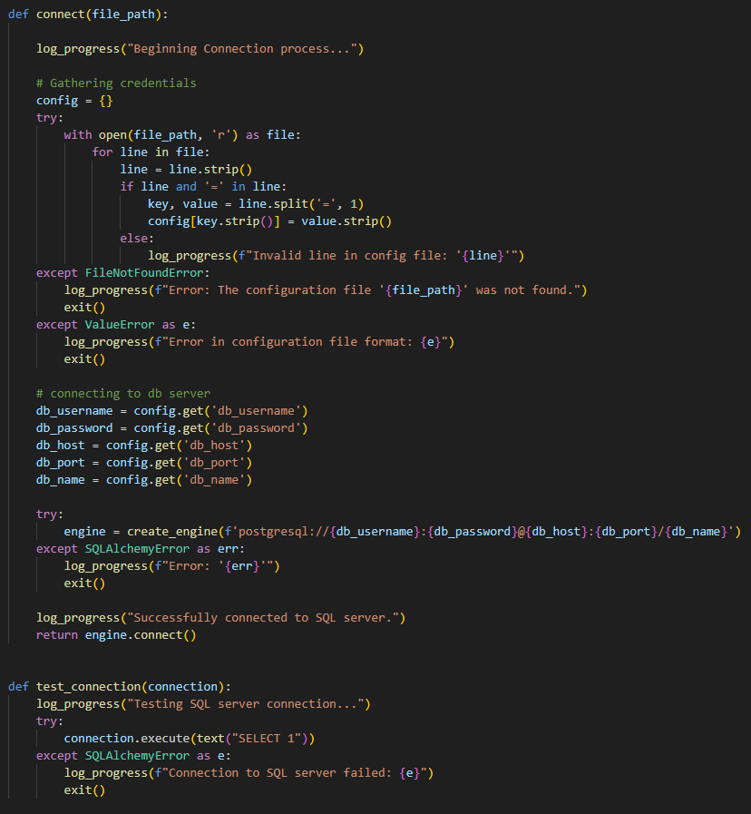

With the SQLAlchemy engine, I executed SQL queries to create the necessary tables in the database.

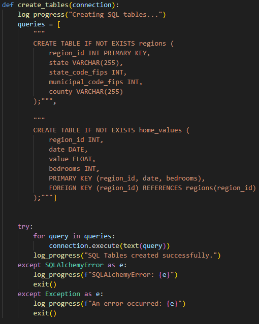

Finally, I loaded and committed all the data into the newly created tables in my PostgreSQL database. Checking the log file confirmed that everything was successful.

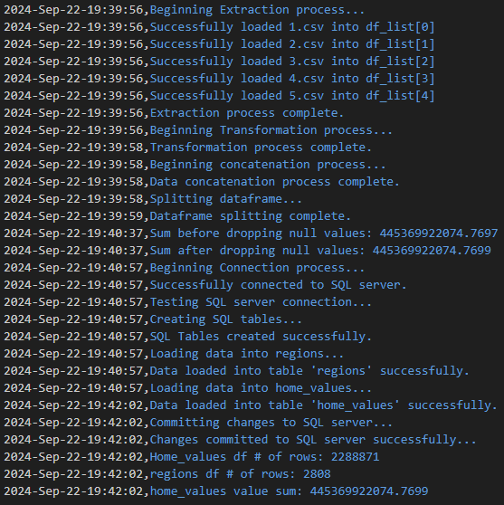

I then went to my PostgreSQL database to confirm the tables were created successfully and the data was loaded.

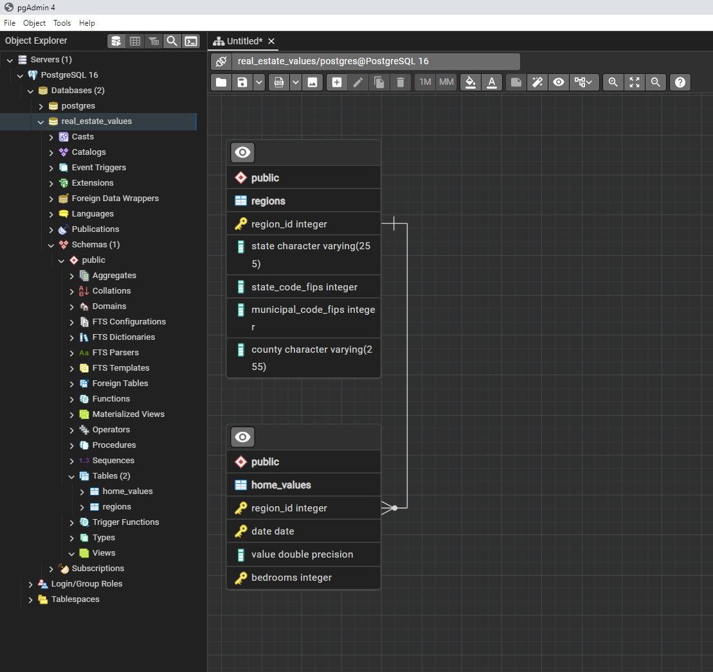

## Power Bi

The final step in the process was to connect my PostgreSQL database to Power BI and upload the data. One part of my dashboard allows users to specify a timeframe and analyze property value growth. To achieve this, I used DAX scripts to create a measure for calculating growth over time.

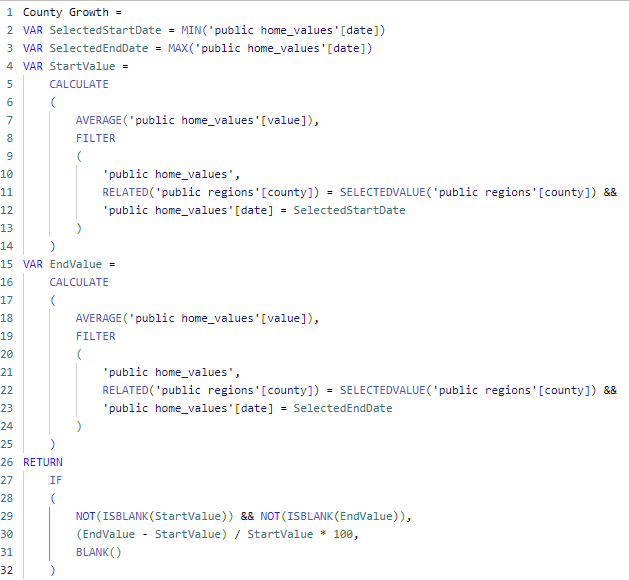

Using this DAX script along with the data from my database, I created an interactive dashboard that allows users to filter data by state, county, timeframe, and number of bedrooms. The dashboard includes the following visualizations:

1. A heatmap showing which counties in the selected state have seen the most growth.
2. A county growth chart displaying the counties with the highest property values.
3. A line chart showing the average property values over time.

